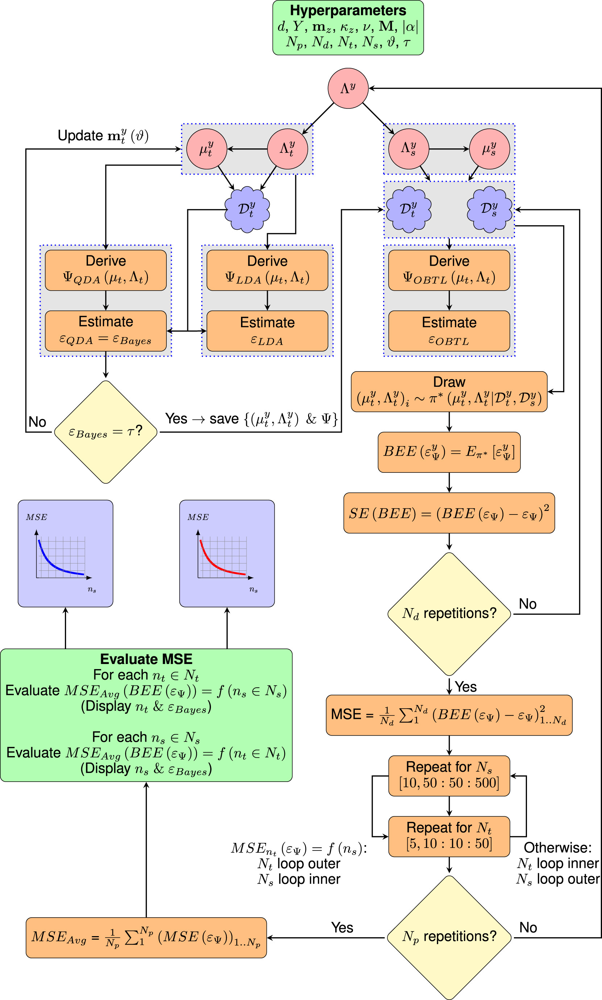

#  Bayesian Error Estimation in the Context of Optimal Bayesian Transfer Learning [](https://zenodo.org/badge/latestdoi/407619321)

Official implementation of **T**ransfer **L**earning-based **B**ayesian **E**rror **E**stimator (**TL-based BEE**).

Omar Maddouri, Xiaoning Qian, Francis J. Alexander, Edward R. Dougherty, and Byung-Jun Yoon, "Robust importance sampling for error estimation in the context of optimal Bayesian transfer learning", Patterns Cell Press, vol. 3, no. 3, pp. 100428, 2022.

**NOTE: The *QDA_all_simulations* folder comprehensively reproduces all the simulation scenarios from the paper. For results with a different classifier (i.e.: LDA), change the classifier of interest by updating the file ''simulate_mse_QDA.m''.**

## Dependencies

```Matlab```
```STAN```
```MatlabStan```
```Recent version of a g++ compiler```

## Flow chart illustrating the simulation set-up based on synthetic datasets for the performance analysis of the proposed TL-based BEE



## Usage
**Note: For the QDA simulations, we provide implementations for the importance sampling setup explained in the manuscript and the direct estimate that uses the predictive posterior of the target parameters. These two implementations are controlled through the flag **sampling_mode** in the file **simulate_mse_QDA.m**.
1) Download the GitHub repository.
2) Uncompress all zip folders (for simulations using Schizophrenia RNA-seq data, the datasets are publically available [here](https://github.com/mgandal/Shared-molecular-neuropathology-across-major-psychiatric-disorders-parallels-polygenic-overlap#readme)).
3) cd relevant simulation folder (i.e.: QDA_all_simulations)
4) Run :
```
matlab simulate_mse_QDA.m
``` 
**Note: For more details about the hyperparameter tuning and the experimental setup, please refer to the manuscript and the supplementary materials.**

## Cite

Please cite our paper if you use this code in your own work.

```
O. Maddouri, X. Qian, F. Alexander, E. Dougherty, and B.-J. Yoon, "Robust importance sampling for error estimation in the context of optimal Bayesian transfer learning", Patterns Cell Press, vol. 3, no. 3, pp. 100428, 2022.
```
